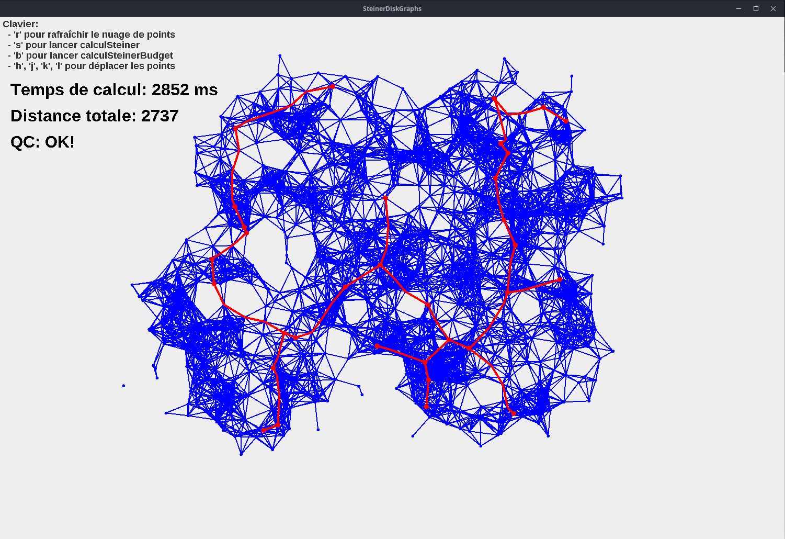
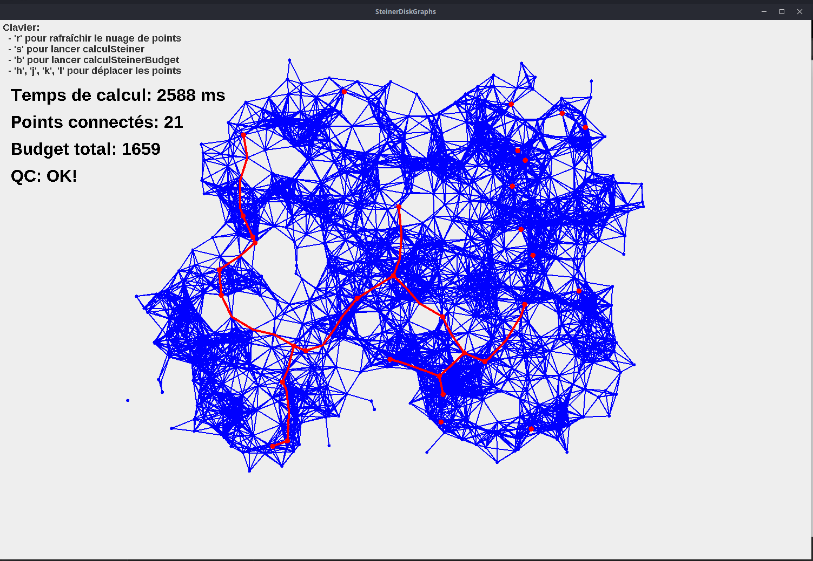

# Steiner Tree

> **In** : `Points`, une liste de coordonnées de points en 2D ; `edgeThreshold` un double ; `hitPoints` une liste de Points
**Out** : arbre `Tree`, de poids total minimum, couvrant tous les points de hitPoints, dont tout sommet est dans `Points`, dont toute arête est de distance inférieur au seuil `edgeThreshold`.

## Without budget

## With budget

